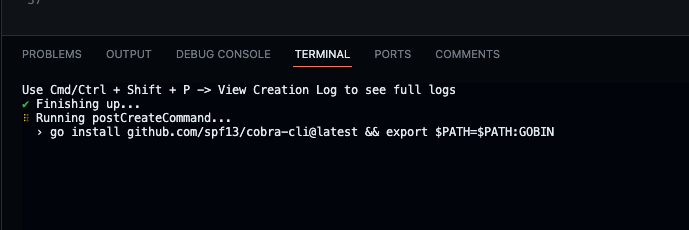
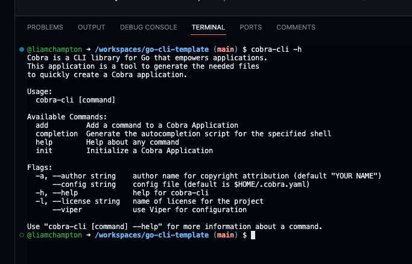

# go-cli-gpt
This is a CLI designed to take GPT to the terminal. It utilises the use of Azure OpanAI Go SDK to generate text based on the input given.

This project is using https://github.com/spf13/cobra as a foundation.

## Commands

| Command  | Flag(s)           | Description                                             |
|----------|----------------|---------------------------------------------------------|
| question | `--local`/`-l`       | Ask a question to generate text based on the input.     |
| image    | n/a    | Create an image from a prompt using the OpenAI API and DALLE<X> model |

## Prerequisites
- Azure account
- GPT Model deployed in Azure OpenAI
- DALLE model deployed in Azure OpenAI
- Local model for Ollama installed (for local/offline use only)


## Getting started

To get started, fork or clone this repository to your own location or open this repository in a codespace.

If you are opening this in a Codespace, wait for the Codespace to set up fully and you will be presented with a screen that looks like VSCode, but in your browser.

Once this has opened you will need to wait just a moment longer for the post create command to finish setting up the environment. You will know this is done when you see the following in the terminal:



## Create your .env file
In the root of the project create a `.env` file and add the following lines to it:

```bash
AZURE_OPENAI_API_KEY=<your-openai-api-key>
YOUR_MODEL_DEPLOYMENT_NAME=<your-model-deployment-name>
AZURE_OPENAI_ENDPOINT=<your-endpoint-url>
DALLE_MODEL_NAME=<your-dalle-model-name>
LOCAL_MODEL=<your-local-model-name>
```

> **Note:** The remote model values can be found in your Azure OpenAI resource.

## Running the CLI
Once you have populated the `.env` file with the correct values, you can build the CLI and run it in your terminal. To do this, run the commands:

```bash
go build
./go-cli-gpt
```

Ask your first question:

```bash
./go-cli-gpt question
> Enter your question: <your-question>
```

> **Note:** To ask a question using the local model, you can use the `--local` flag. This will generate text based on the local model you have installed.

Create your first AI generated image:
    
```bash
./go-cli-gpt image
> What image do you want to create? <your-prompt>
```

## Commands

So far there is only 1 command created, `question` and this can be seen within the `/cmd` directory.

The pre-installed Cobra CLI tools can help make your project far more extensible with little work.

To see the commands available with Cobra, run the command:

```bash
cobra-cli -h
```

This will show you the following output:



### Adding a new command

Adding a new command at the root level is very easy to do, you just need to use the following command:

```bash
cobra-cli add <name of new command>
```

Once you have done this, navigate to the new command within the `/cmd` directory and edit the boilerplate code provided for your needs.

This is a basic foundation for you to build ontop of without the hassel of setup. Adding flags and subcommand palletes is bespoke to your own projet and information on how to do that can be found in the offical docs - https://pkg.go.dev/github.com/spf13/cobra#section-readme

